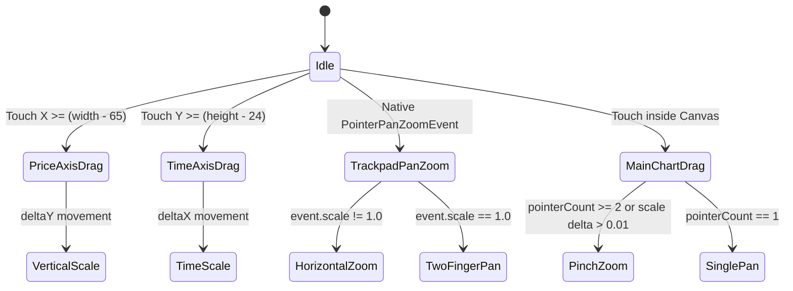

# Architecture & Engine Internals

This document details the internal architecture, mathematical models, rendering pipeline, and gesture routing mechanism behind **`im_charts`**.

---

## 🏛️ High-Level System Architecture

```mermaid
flowchart TD
    subgraph DataSourceLayer ["Data Source Layer"]
        DS[ChartDataSource] --> |Historical Candles| CB[CandleBuilder]
        DS --> |Real-time Ticks / Candles| CB
    end

    subgraph ControllerLayer ["Engine & State Controller"]
        CB --> CC[TradingChartController]
        IND[Technical Indicators Engine] --> CC
        VP[ChartViewport] --> CC
        PR[PriceRange Calculator] --> CC
    end

    subgraph PresentationLayer ["UI & Gesture Routing"]
        CC --> |ChangeNotifier| TS[TradingScreen]
        TS --> TB[ChartToolbar (Row 1)]
        TS --> StackLayout[Overlay Stack]
        StackLayout --> TC[TradingChart (Canvas)]
        StackLayout --> CH[ChartHeader Overlay (Row 2)]
    end

    subgraph RenderingPipeline ["Direct Canvas Renderer (Impeller / Skia)"]
        TC --> CP[ChartPainter]
        CP --> CPL[ChartPaneLayout]
        CP --> CR[CandleRenderer]
        CP --> VR[VolumeRenderer]
        CP --> IR[IndicatorRenderer]
        CP --> AR[AxisRenderer]
        CP --> XR[CrosshairRenderer]
    end
```

---

## 📐 Mathematical Foundations

### 1. Price-to-Y Coordinate Projection

The engine maps continuous price values to canvas pixel coordinates using an inverted linear projection (`bounds.top` is $0$, while highest prices appear at the top):

$$Y = \text{bounds.bottom} - \left( \frac{\text{price} - \text{minPrice}}{\text{maxPrice} - \text{minPrice}} \right) \times \text{bounds.height}$$

The inverse function maps pointer Y touches back into exact market prices:

$$\text{Price} = \text{minPrice} + \left( \frac{\text{bounds.bottom} - Y}{\text{bounds.height}} \right) \times (\text{maxPrice} - \text{minPrice})$$

Implemented in [`CoordinateConverter`](file:///Users/princeraj/Storage%20Drive/Files/Projects/charts/im_charts/lib/core/coordinates/coordinate_converter.dart).

---

### 2. Time-to-X Index Projection

Unlike naive charting libraries that space candles proportionally to absolute timestamps (which produces blank voids during weekends and market holidays), `im_charts` indexes candles sequentially:

$$X = \text{viewportWidth} - \text{rightMargin} - (\text{totalCandles} - 1 - \text{index}) \times (\text{candleWidth} + \text{candleSpacing}) + \text{scrollOffset}$$

This provides:
- Seamless support for intraday equity trading (market closes, holidays, and weekends collapse naturally).
- Rapid $O(1)$ coordinate mapping in both directions via `xToIndex(double x)`:

$$\text{Index} = (\text{totalCandles} - 1) - \text{round}\left( \frac{\text{viewportWidth} - \text{rightMargin} + \text{scrollOffset} - X}{\text{candleTotalWidth}} \right)$$

---

### 3. Focal-Point Zoom Anchor Preservation

When a user pinches or uses the trackpad/mouse wheel over the chart, the candle directly beneath the cursor must remain fixed at that exact pixel position during zoom:

Given:
- Focal point $X_f$
- Old candle total width $W_{\text{old}} = w_{\text{old}} + s$
- New candle total width $W_{\text{new}} = w_{\text{new}} + s$
- Scale ratio $R = \frac{W_{\text{new}}}{W_{\text{old}}}$
- Distance from right edge to focal point: $D_f = \text{viewportWidth} - \text{rightMargin} - X_f + \text{scrollOffset}$

The updated scroll offset is computed as:

$$\text{scrollOffset}_{\text{new}} = \text{scrollOffset}_{\text{old}} + D_f \times (R - 1.0)$$

This anchor calculation ensures **zero-jitter, focal-anchored zooming**.

---

## 🎛️ Dual-Pane Layout System

[`ChartPaneLayout`](file:///Users/princeraj/Storage%20Drive/Files/Projects/charts/im_charts/lib/renderer/pane.dart) partitions the total canvas area into dedicated rectangles:

```
+------------------------------------------------------+---------------+
|                                                      |               |
|                   MAIN CHART PANE                    |  PRICE AXIS   |
|         (Grid, Candles, Overlays, Volume)            |  (Primary)    |
|                                                      |               |
+------------------------------------------------------+---------------+
|                SUB PANE (e.g. RSI)                   |   SUB AXIS    |
+------------------------------------------------------+---------------+
|                   TIME AXIS (X)                      |   AUTO PILL   |
+------------------------------------------------------+---------------+
```

- **Main Pane (75% height default)**: Houses candles, EMA/Bollinger overlays, volume bars, and current price line.
- **Sub-Pane (25% height when active)**: Dedicated pane for bounded oscillators like RSI (0–100) or MACD.
- **Price Axis (65px default width)**: Displays formatted price labels, last traded price badge, and vertical scale drag handles.
- **Time Axis (24px default height)**: Dynamic date/time stamps formatted according to the active timeframe.

---

## 🖐️ Gesture Routing & Input Engine

The charting engine distinguishes between multi-zone drag operations through a unified pointer state machine:



### Native macOS Trackpad Support
In Flutter Desktop, trackpad pinch gestures bypass standard touch event listeners and arrive via `PointerPanZoomStartEvent`, `PointerPanZoomUpdateEvent`, and `PointerPanZoomEndEvent`. `im_charts` directly captures these events in `Listener`, providing native 120Hz trackpad pinch zoom without emulation lag.

---

## ⚡ Performance Optimization Guidelines

1. **Clip Canvas Isolation**: All custom painting operations are strictly clipped via `canvas.clipRect` to eliminate offscreen overdraw into parent toolbars.
2. **Visible Window Slicing**: Only candles within `visible.start` to `visible.end` (plus a 4-candle buffer for line continuity) are processed during each render frame.
3. **Immutability & Repaint Boundaries**: The controller notifies listeners only when viewport parameters or market ticks update. `shouldRepaint` checks delegate properties before scheduling Skia redraws.
